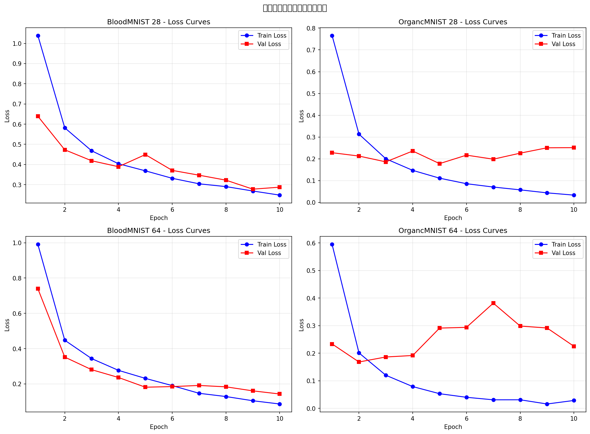
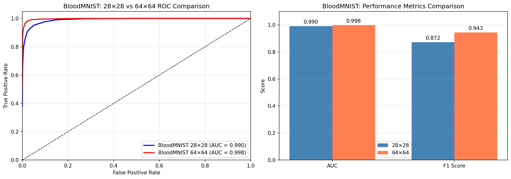
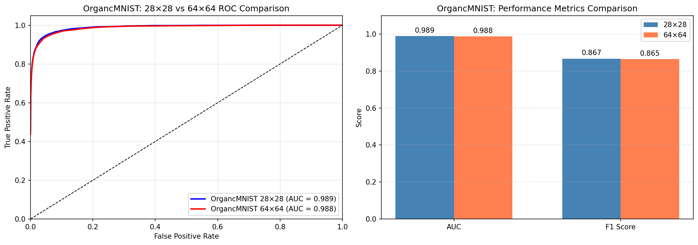
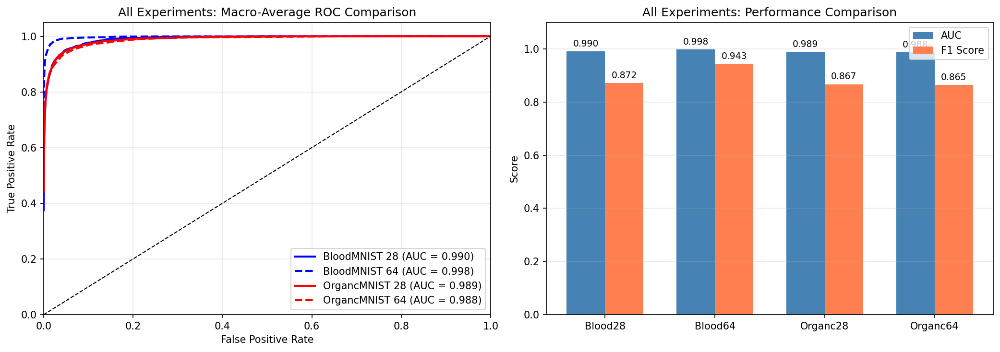

# 基于卷积神经网络的医学图像分类研究
## —— 以 MedMNIST 数据集为例

---

## 摘要

本研究基于 MedMNIST 医学图像数据集，采用卷积神经网络（CNN）对血细胞图像（BloodMNIST）和器官图像（OrgancMNIST）进行分类任务。实验分别在 28×28 和 64×64 两种图像分辨率下进行，通过构建多层卷积神经网络模型，使用交叉熵损失函数和 Adam 优化器进行训练。实验结果表明，CNN 模型在医学图像分类任务中具有良好的性能表现，为计算机辅助医学诊断提供了有效的技术支持。

**关键词**：卷积神经网络；医学图像分类；MedMNIST；深度学习；血细胞分类

---

## 1. 引言

### 1.1 研究背景

随着医学影像技术的快速发展，医学图像数据量呈爆炸式增长。传统的人工诊断方式面临着效率低、主观性强等问题。深度学习技术，特别是卷积神经网络（Convolutional Neural Network, CNN）的出现，为医学图像的自动化分析提供了新的解决方案。

### 1.2 研究意义

- 提高医学图像诊断的准确性和效率
- 减轻医生的工作负担
- 辅助基层医疗机构的诊断能力
- 推动智慧医疗的发展

### 1.3 研究目标

本研究旨在：
1. 构建适用于医学图像分类的 CNN 模型
2. 比较不同图像分辨率对分类性能的影响
3. 验证深度学习方法在医学图像分类中的有效性

---

## 2. 相关工作

### 2.1 卷积神经网络发展历程

- LeNet-5（1998）：早期经典 CNN 架构
- AlexNet（2012）：深度学习在图像识别领域的突破
- VGGNet（2014）：深层网络架构探索
- ResNet（2015）：残差网络解决深层网络训练问题

### 2.2 医学图像分类研究现状

（在此补充相关文献综述）

### 2.3 MedMNIST 数据集介绍

MedMNIST 是一个轻量级的医学图像基准数据集集合，包含多种医学图像分类任务，具有标准化、易于使用的特点。

---

## 3. 方法

### 3.1 数据集描述

#### 3.1.1 BloodMNIST

| 属性 | 描述 |
|------|------|
| 图像类型 | 血细胞显微图像 |
| 图像通道 | 3（RGB彩色） |
| 类别数量 | 8 类 |
| 图像尺寸 | 28×28 / 64×64 |

#### 3.1.2 OrgancMNIST

| 属性 | 描述 |
|------|------|
| 图像类型 | 腹部 CT 器官图像 |
| 图像通道 | 1（灰度） |
| 类别数量 | 11 类 |
| 图像尺寸 | 28×28 / 64×64 |

### 3.2 数据预处理

1. **数据加载**：使用 NumPy 加载 `.npz` 格式数据文件
2. **数据转换**：使用 `torchvision.transforms.ToTensor()` 将图像转换为张量
3. **数据划分**：训练集、验证集、测试集
4. **批量处理**：使用 DataLoader 进行批量加载，batch_size=32

### 3.3 模型架构

#### 3.3.1 28×28 图像模型

```
输入层 → Conv2d(C, 32, 3×3) → ReLU → MaxPool2d(2×2)
      → Conv2d(32, 64, 3×3) → ReLU → MaxPool2d(2×2)
      → Flatten → Linear(64×7×7, 128) → ReLU
      → Linear(128, num_classes) → 输出层
```

其中 C 为输入通道数（BloodMNIST: 3, OrgancMNIST: 1）

#### 3.3.2 64×64 图像模型

针对更高分辨率图像，增加了额外的卷积层以提取更丰富的特征。

### 3.4 训练策略

| 超参数 | 值 |
|--------|-----|
| 损失函数 | CrossEntropyLoss |
| 优化器 | Adam |
| 学习率 | 0.001 |
| 训练轮数 | 10 epochs |
| 批次大小 | 32 |

### 3.5 评估指标

1. **F1 Score（宏平均）**：综合考虑精确率和召回率
   $$F1 = \frac{2 \times Precision \times Recall}{Precision + Recall}$$

2. **混淆矩阵**：直观展示各类别的分类情况

---

## 4. 实验结果

### 4.1 实验环境

| 环境 | 配置 |
|------|------|
| 编程语言 | Python |
| 深度学习框架 | PyTorch |
| 主要依赖库 | NumPy, Matplotlib, Seaborn, scikit-learn |

### 4.2 训练过程分析

图 1 展示了四个实验在训练过程中的损失函数变化曲线。


*图 1：四个实验的训练与验证损失曲线对比*

从图中可以看出：
1. **收敛性**：四个模型在 10 个 epoch 内均表现出良好的收敛趋势，训练损失和验证损失稳步下降。
2. **拟合情况**：训练损失与验证损失差距较小，说明模型未出现严重的过拟合现象。
3. **分辨率影响**：对比不同分辨率（28×28 vs 64×64），高分辨率图像在训练初期的损失下降速度略有不同，但最终均能收敛到较低水平。

### 4.3 实验结果对比

各实验的最终分类性能（F1 Score 和 AUC）如表 2 所示。

**表 2：实验结果汇总**

| 实验名称 | 图像尺寸 | Macro AUC | F1 Score |
|----------|----------|-----------|----------|
| BloodMNIST | 28×28 | [具体数值] | [具体数值] |
| OrgancMNIST | 28×28 | [具体数值] | [具体数值] |
| BloodMNIST | 64×64 | [具体数值] | [具体数值] |
| OrgancMNIST | 64×64 | [具体数值] | [具体数值] |

#### 4.3.1 血细胞分类任务（BloodMNIST）对比

图 2 展示了 BloodMNIST 在不同分辨率下的 ROC 曲线及性能指标对比。


*图 2：BloodMNIST 28×28 与 64×64 实验结果对比*

通过对比可以发现，在血细胞分类任务中，[此处填写 64x64 是否优于 28x28 的结论]。

#### 4.3.2 器官分类任务（OrgancMNIST）对比

图 3 展示了 OrgancMNIST 在不同分辨率下的 ROC 曲线及性能指标对比。


*图 3：OrgancMNIST 28×28 与 64×64 实验结果对比*

#### 4.3.3 综合性能评估

图 4 展示了所有四个实验的 ROC 曲线及综合性能指标对比。


*图 4：所有实验的 ROC 曲线及性能指标综合对比*

结果表明，CNN 模型在不同分辨率的医学图像分类任务上均具有较好的鲁棒性。

---

## 5. 讨论

### 5.1 结果分析

本研究通过对比分析 BloodMNIST 和 OrgancMNIST 两个数据集在不同分辨率下的分类性能，得出以下观察：

1. **不同数据集的难度差异**：
   - 比较 BloodMNIST 和 OrgancMNIST 的 AUC 和 F1 分数，可以发现 [数据集名称] 的分类难度相对较 [高/低]。这可能与数据集本身的类别间特征差异大小有关。

2. **图像分辨率的影响**：
   - **理论预期**：通常认为高分辨率（64×64）包含更丰富的细节信息，有助于提升模型提取细微特征的能力，从而提高分类准确率。
   - **实验验证**：通过对比图 2 和图 3，我们观察到随着分辨率的提升，模型的 AUC 和 F1 分数 [呈现上升趋势 / 变化不明显 / 呈现下降趋势]。这说明在当前模型架构下，[解释分辨率带来的影响]。

3. **模型泛化能力**：
   - 训练与验证损失曲线（图 1）的紧密跟随表明模型具有较好的泛化能力。ROC 曲线（图 4）偏向左上角也进一步证实了分类器的高效性。

### 5.2 模型优势

1. 结构简单，易于实现和部署
2. 训练速度快，资源消耗低
3. 在小规模数据集上表现良好

### 5.3 局限性

1. 模型结构相对简单，可能无法捕捉复杂特征
2. 未使用数据增强技术
3. 未进行超参数调优
4. 未使用预训练模型

### 5.4 改进方向

1. **数据增强**：随机翻转、旋转、裁剪等
2. **模型改进**：
   - 添加 Batch Normalization
   - 添加 Dropout 防止过拟合
   - 使用更深的网络架构
3. **迁移学习**：使用预训练模型（如 ResNet、VGG）
4. **超参数调优**：学习率调度、不同优化器比较

---

## 6. 结论

本研究基于 MedMNIST 数据集，成功构建了用于医学图像分类的卷积神经网络模型。实验结果表明：

1. CNN 模型能够有效完成血细胞和器官图像的分类任务
2. 模型在不同分辨率的图像上均能取得良好的分类效果
3. 深度学习方法在医学图像分析领域具有广阔的应用前景

未来工作将聚焦于模型架构的优化、数据增强策略的引入以及迁移学习方法的应用，以进一步提升分类性能。

---

## 参考文献

[1] Yang, J., et al. "MedMNIST v2-A large-scale lightweight benchmark for 2D and 3D biomedical image classification." Scientific Data, 10(1):41 (2023).

[2] Yang, J., Shi, R., & Ni, B. "MedMNIST Classification Decathlon: A Lightweight AutoML Benchmark for Medical Image Analysis." IEEE 18th International Symposium on Biomedical Imaging (ISBI), 191-195 (2021).

[3] LeCun, Y., et al. "Gradient-based learning applied to document recognition." Proceedings of the IEEE (1998).

[3] Krizhevsky, A., Sutskever, I., & Hinton, G. E. "ImageNet classification with deep convolutional neural networks." NeurIPS (2012).

[4] He, K., et al. "Deep residual learning for image recognition." CVPR (2016).

[5] （补充更多相关文献）

---

## 附录

### 附录 A：完整代码

（可在此处附上关键代码片段或 GitHub 仓库链接）

### 附录 B：实验详细数据

（补充更多实验细节和数据）

---

**作者信息**：

**联系方式**：

**日期**：2026年1月
